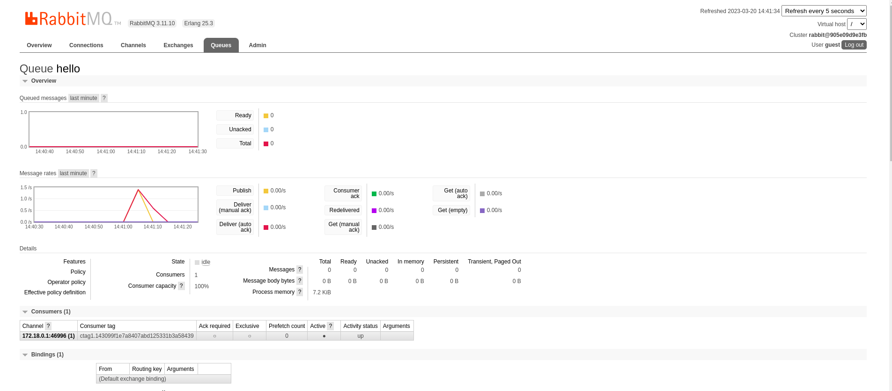
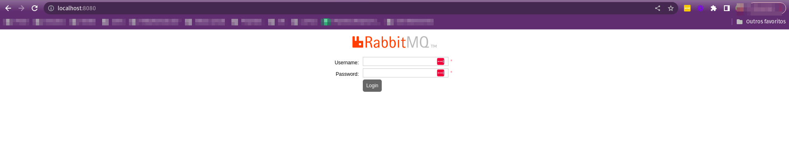
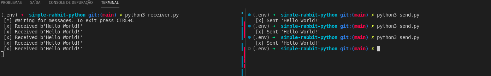

<h1 align="center">Simple Lab Python Rabbit </h1>

<p align="center">
  
</p>

## Ambiente Virtual
```bash
sudo apt install python3.9-venv
python3 -m venv .env
source .env/bin/activate
deactivate
```

## Rabbit Dcker

- Subir o Rabbit

```bash
docker run -d --rm -p 5672:5672 -p 8080:15672 rabbitmq:3-management
```

## Acessar Rabbir

<p align="center">
  
</p>

- http://localhost:8080
- user: guest
- password: guest

## Produtor e consumidor

- Producer

```bash
python3 send.py
```

- Consumer
```bash
python3 receiver.py
```

<p align="center">
  
</p>
